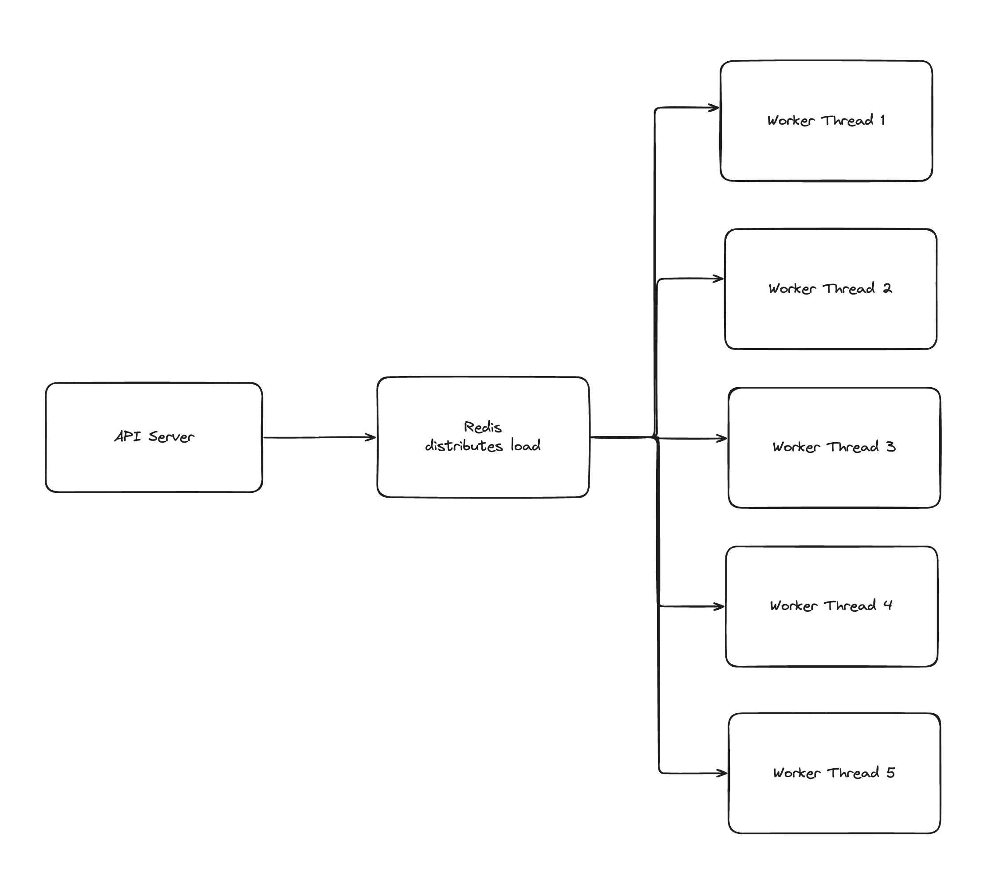
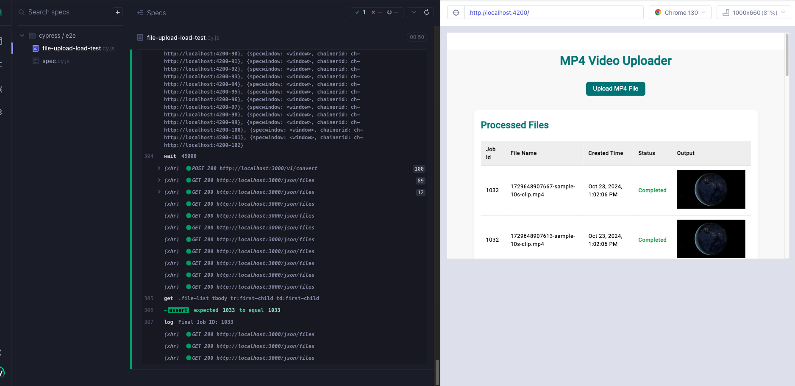

# Project Name

## Table of Contents

- [Overview](#overview)
- [Architecture Overview](#architecture-overview)
- [Pre-requisites](#pre-requisites)
- [Folder Structure](#folder-structure)
- [Setup and Deployment](#setup-and-deployment)
- [Application Endpoints](#application-endpoints)

## Overview

This project includes a distributed system with a frontend, backend, and worker services. The stack uses Redis to manage distributed job queues, and the worker threads are set up with replicas to handle concurrent tasks efficiently. Cypress is used for automated testing to ensure application reliability.

## Architecture Overview

The architecture leverages Redis to distribute the workload between multiple worker threads, which are separate from the main API server. This approach ensures that the main API server remains responsive and is not blocked by long-running tasks or computationally intensive operations.

By using Redis and worker threads, the application can:

- **Efficiently distribute tasks**: Redis acts as a centralized queue that assigns tasks to available worker threads. This allows the system to scale horizontally as needed.
- **Prevent server blocking**: Offloading tasks to worker threads helps keep the main API server responsive, as it does not handle long-running operations directly.

Below is the architecture diagram illustrating this setup:



## Pre-requisites

Ensure the following tools are installed on your system before starting:

- **Docker** (Version 27 or higher)
- **Node.js** with **npm**

To install Cypress dependencies, run the following command from the root of the project:

```bash
npm install
```

## Folder Structure

The project is organized as follows:

```bash
project-root/
├── api/                      # Contains the backend code
├── client/                   # Contains the frontend (Angular) code
├── cypress/                  # Cypress test suite
│   ├── e2e/                  # Contains Cypress e2e load tests
│   ├── fixtures/             # Fixture files for testing
│   ├── support/              # Cypress commands and support files
├── docker-compose.yml        # Docker Compose configuration for deploying services
└── bootstrap.sh              # Shell script to deploy services

```

## Setup and Deployment

Step 1: Start the Stack
To deploy the entire stack, navigate to the project root directory and execute the bootstrap script:

```bash
sh bootstrap.sh
```

This will deploy the following services using Docker Swarm or Docker Compose:

- **Frontend (Angular app)** at [http://localhost:42000](http://localhost:42000)
- **Backend (API)** at [http://localhost:3000](http://localhost:3000)
- **Redis** at `localhost:6379`
- **Worker Threads** running as 5 replicas, distributed via Redis Bull queue

### Step 2: Starting Development Server

If you want to start the development server without deploying on Docker Swarm, you can use the following command:

```bash
docker compose up
```

This command will spin up all the required containers in development mode using Docker Compose.

## Application Endpoints

- **Frontend**: Accessible at [http://localhost:42000](http://localhost:42000)
- **Backend API**: Accessible at [http://localhost:3000](http://localhost:3000)
- **Redis**: Accessible at `localhost:6379`

The worker threads are managed internally with a replica count of 5, distributing the load through the Redis Bull queue.

### Running Cypress Tests

To execute the Cypress tests, make sure the application stack is up and running. Then, you can open Cypress using:

```bash
npx cypress open
```

This command will launch the Cypress Test Runner, where you can select and execute tests. Alternatively, you can run tests headlessly using:

```bash
npx cypress run
```

Below is the load test diagram illustrating the system's performance under stress:


